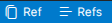
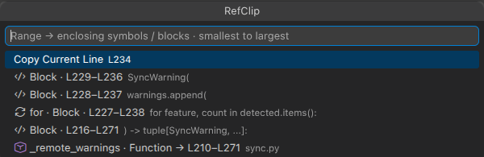
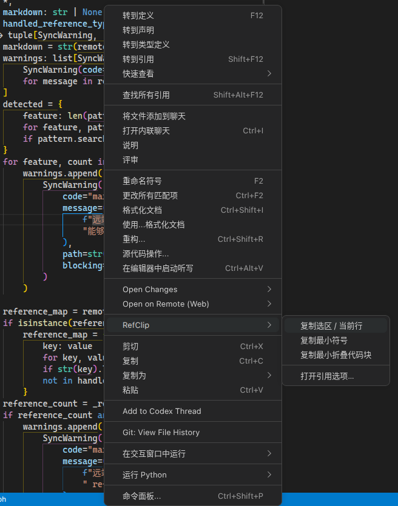
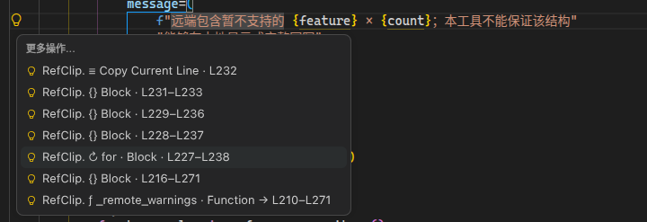

# RefClip: Copy Path & Line Numbers

**English** | [简体中文](./README.zh-CN.md)

**Copy file paths with line numbers — for a selection, a whole function, or a code block.**

RefClip turns code locations into references you can paste into Codex, Claude Code, issue reports, or Markdown notes. Choose absolute or relative paths and customize the output format.

```text
[user.ts createUser](./src/user.ts#L20-L35)
```

### What you can do

- **Copy a path with line numbers:** select a range and click **Ref** in the status bar.
- **Reference a whole function or class:** place the cursor inside it to copy the smallest enclosing symbol, without selecting its lines manually.
- **Choose a larger scope:** click **Refs** to browse enclosing symbols and folding blocks, from smallest to largest.
- **Prepare references for AI coding assistants:** use Markdown links or the included Claude Code template. RefClip copies location text to your clipboard; your assistant needs access to the referenced files.

RefClip runs locally and does not send your code to a server.

https://github.com/user-attachments/assets/0c1cb1d5-b47a-4969-9a87-9ea2aa454f3d

<video controls src="./docs/.assets/README.md/overview.mp4" title="RefClip demo"></video>

[Watch the demo](./docs/.assets/README.md/overview.mp4)

## Installation

Install [RefClip from the VS Code Marketplace](https://marketplace.visualstudio.com/items?itemName=Huffer342.refclip), or run:

```bash
code --install-extension Huffer342.refclip
```

For manual installation, download a `.vsix` from [Releases](https://github.com/Huffer342-WSH/Ref-Clip/releases), then choose **Install from VSIX…** in the Extensions view menu.

Requires **VS Code 1.85 or later** . To recognize functions, classes, and other symbols, enable the appropriate language extension and check that the symbols appear in VS Code's Outline view.

## Usage

### Quick copy

Click **Ref** in the status bar:

- With a selection: copy a reference to exactly that range, without expanding it to a function.
- With only a cursor: reference the smallest enclosing symbol, such as a function or method. If no symbol is found, use the current line.

Paste the result wherever you need it. The status bar briefly shows what was copied.

<p align="center">

</p>

### Choose a function, class, or block

Click **Refs** in the status bar to open the reference picker. It lists the selection or current line first, followed by enclosing symbols and folding blocks, from smallest to largest.

Symbols use icons similar to VS Code's Outline. Blocks show their first line, with hints for keywords such as `if` and `for` when recognized.

<p align="center">

</p>

The editor's **RefClip** context submenu also offers three direct copy actions:

| Action | Target |
| --- | --- |
| Copy selection / current line | Selected range, or the current line when nothing is selected |
| Copy smallest symbol | Smallest symbol containing the selection or cursor |
| Copy smallest folding block | Smallest folding range containing the selection or cursor |

If no matching symbol or block is found, RefClip shows a message and leaves the clipboard unchanged.

<p align="center">

</p>

### Use the lightbulb menu

Press **Ctrl+.** ( **Cmd+.** on macOS), or click the lightbulb, then choose an entry beginning with **RefClip.** under **More Actions** .

Text markers such as `ƒ`, `◇`, `▱`, and `{}` distinguish target types. VS Code does not let extensions define custom lightbulb group headings, so RefClip uses the built-in More Actions group.

<p align="center">

</p>

## Settings

Search for `@ext:Huffer342.refclip` in VS Code Settings to see all options.

### Path format

`refclip.pathStyle` controls the link target in the default templates:

| Value | Base directory | Example |
| --- | --- | --- |
| `absolute` (default) | Absolute filesystem path | `/home/user/project/src/user.ts` |
| `workspaceRelative` | Workspace folder containing the file | `./src/user.ts` |
| `fileRelative` | Directory containing the file | `./user.ts` |

Absolute paths can help avoid ambiguity when VS Code and your AI coding assistant can access the same files. Relative paths are easier to share across machines, but both sides need to agree on the base directory.

### Status bar buttons

This configuration uses workspace-relative paths and keeps both buttons on the right:

```json
{
  "refclip.pathStyle": "workspaceRelative",
  "refclip.quickCopyBehavior": "selectionOrSymbol",
  "refclip.showQuickCopyButton": true,
  "refclip.showOptionsButton": true,
  "refclip.statusBarAlignment": "right",
  "refclip.statusBarPriority": -100
}
```

Options for `quickCopyBehavior`:

| Value | Clicking Ref copies |
| --- | --- |
| `selectionOrSymbol` (default) | Selection, otherwise the smallest symbol, falling back to the current line |
| `selection` | Selection or current line |
| `symbol` | Smallest enclosing symbol |
| `block` | Smallest enclosing folding block |

You can hide each button independently. Set `statusBarAlignment` to `left` or `right`; a higher `statusBarPriority` places the buttons farther left on that side. Changes take effect immediately, although other extensions may place items between the two buttons.

### Customize copied text

Templates insert file names, line numbers, and symbol names into your chosen format.

#### Codex template (default)

RefClip's default Markdown links provide a file path and line numbers when pasted into Codex. Range and symbol references use different link labels:

```json
{
  "refclip.rangeTemplate": "[{fileName}#L{startLine}-L{endLine}]({path}#L{startLine}-L{endLine})",
  "refclip.singleLineTemplate": "[{fileName}#L{startLine}]({path}#L{startLine})",
  "refclip.symbolTemplate": "[{fileName} {symbolName}]({path}#L{startLine}{lineRangeSuffix})"
}
```

Example output:

```text
[user.ts#L20-L35](/home/user/project/src/user.ts#L20-L35)
[user.ts#L20](/home/user/project/src/user.ts#L20)
[user.ts createUser](/home/user/project/src/user.ts#L20-L35)
```

#### Claude Code template

For Claude Code, you can use `@file-path#start-end`.

> The [Claude Code VS Code documentation](https://code.claude.com/docs/en/ide-integrations) uses line ranges such as `#5-10`, without an `L` prefix.

Add this configuration to VS Code Settings:

```json
{
  "refclip.rangeTemplate": "@{relativePath}#{startLine}-{endLine}",
  "refclip.singleLineTemplate": "@{relativePath}#{startLine}",
  "refclip.symbolTemplate": "@{relativePath}#{startLine}-{endLine} ({symbolName})"
}
```

Example output:

```text
@./src/user.ts#20-35
@./src/user.ts#20
@./src/user.ts#20-35 (createUser)
```

These examples use workspace-relative paths. Use the same workspace directory as the base in Claude Code.

#### Template variables

| Variable | Meaning |
| --- | --- |
| `{path}` | Path using the selected path style |
| `{absolutePath}` / `{relativePath}` / `{fileRelativePath}` | Absolute / workspace-relative / file-directory-relative path, independent of the path style setting |
| `{fileName}` | File name |
| `{startLine}` / `{endLine}` | One-based start and end line numbers |
| `{startCharacter}` / `{endCharacter}` | Zero-based character offsets; the end position is exclusive |
| `{symbolName}` / `{symbolKind}` | Symbol name / numeric VS Code symbol kind |
| `{lineRangeSuffix}` | Empty for one line; otherwise `-L` followed by the end line |

Templates only substitute variables; they do not execute code. Missing optional values become empty strings, and unknown variables remain unchanged. If an older template uses `{absolutePath}`, replace it with `{path}` to follow the path style setting.

Customize symbol labels in the picker separately, without changing the copied text:

```json
{
  "refclip.symbolOptionTemplate": "{symbolIcon} {symbolName} · {symbolKind} → {range}"
}
```

In this display template, `{symbolKind}` is the type name, `{symbolIcon}` is the Outline icon, and `{range}` is the line range.

## Notes and limitations

- With multiple cursors, only the primary selection is used. A selection ending at column zero of the next line excludes that line.
- Symbol references use declarations in the current file; they do not navigate from a function call to its definition.
- Blocks use VS Code's folding ranges, which may omit the closing brace. Manually created folding ranges are not returned by this API.
- Keywords such as `if` and `for` are inferred from the first line of a fold, not from full syntax analysis.

## Development and contributing

### Environment

Install Node.js 24 and VS Code 1.85 or later, then install dependencies in the project root:

```bash
npm ci
```

### Debugging

Open the [RefClip workspace](./.vscode/refclip.code-workspace), choose **RefClip: Run Extension** , and press **F5** . The workspace includes build tasks and launch configurations. Open your test project folder in the Extension Development Host.

Source changes compile automatically. Run **Developer: Reload Window** in the development host to load them.

```bash
npm test          # Unit tests
npm run test:ct   # Component tests in a real VS Code host
```

### Packaging

```bash
npm run package
```

The package is written to `out/refclip-<version>.vsix`. Install it using VS Code's **Install from VSIX…** command.

See the [architecture document](./docs/architecture.md) and [development and release guide](./docs/development.md) for more details (in Chinese).

Report problems through [Issues](https://github.com/Huffer342-WSH/Ref-Clip/issues).

Licensed under the [MIT License](./LICENSE).
