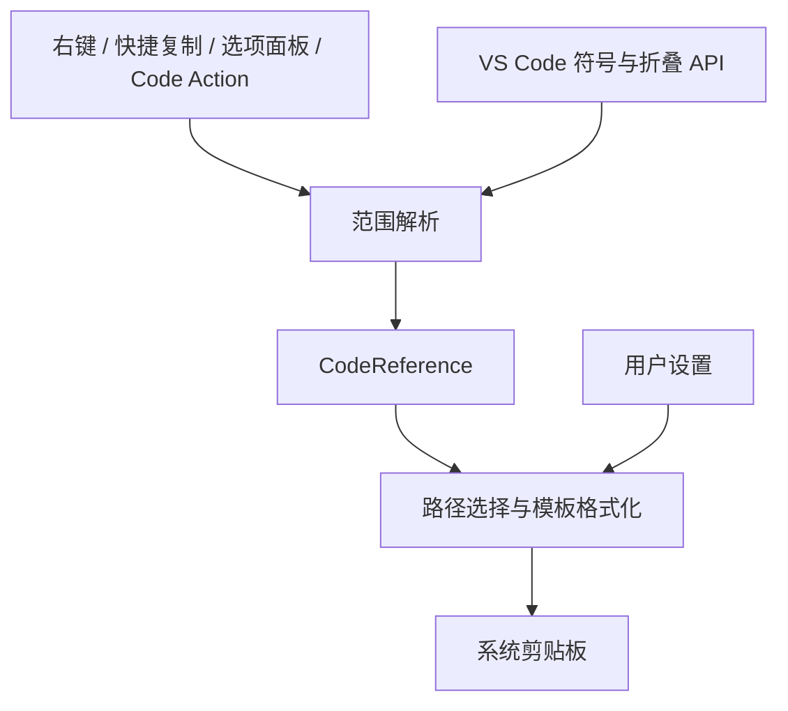

# RefClip 架构说明

## 职责与数据流

RefClip 将编辑器中的代码位置转换为结构化引用，再根据模板生成文本并写入剪贴板。符号和折叠范围由 VS Code 提供；插件不依赖某个 AI 助手，不自行实现 AST，也不发送网络请求。

复制入口共享格式化和剪贴板逻辑。面板与 Code Action 还共享同一份候选列表，避免两处显示不同范围。

## 引用解析

### 选区与符号

快捷复制优先保留非空选区。只有光标时，解析器寻找包含光标的最小符号；没有符号则使用当前行。直接复制符号时，解析器要求目标包含整个选区，不会只根据选区首行选择函数。

符号来自 `vscode.executeDocumentSymbolProvider`。解析器将 DocumentSymbol 树展开，记录嵌套深度；也兼容 SymbolInformation，并过滤其他文件的结果。候选符号按范围大小排序，重复项被去除。

早期按名称交集自动扩展单行选区的逻辑已移除。当前入口统一遵循“显式选区优先”的规则。

### 折叠代码块

代码块来自 `vscode.executeFoldingRangeProvider`。解析器过滤越界、空范围和重复结果，保留包含当前选区的折叠范围，并按大小排序。

折叠结束行是包含关系，与文本选区的结束位置语义不同。转换时保留折叠末尾的空行，不擅自补上闭合括号。

注释、导入和 Region 类型使用 API 返回的类型。其他代码块只根据首行关键字生成显示提示；提示不会改变引用范围。

### 结构化引用

`CodeReference` 保存 URI、绝对路径、两种相对路径、文件名、起止位置，以及可选的符号或代码块信息。

行号从 1 开始；字符偏移从 0 开始，使用 UTF-16 单位，结束位置不包含在内。普通选区若结束于下一行第 0 列，会归一化到上一行末尾。

## 格式化与界面

### 路径和模板

文件系统路径使用 `Uri.fsPath`，相对路径使用 Node.js 路径工具生成。输出中的相对路径统一使用 `/` 分隔符，并带 `./` 或 `../` 前缀。Windows 跨盘符时保留绝对路径。

格式化器根据引用类型选择单行、多行或符号模板，仅进行一次变量替换。`{path}` 跟随路径设置，显式路径变量不受该设置影响。界面提示模板与复制模板相互独立。

### 入口与过期保护

Code Action 和选项面板捕获文档对象、版本和引用范围。执行复制时，如果文档已经关闭或版本变化，插件拒绝使用旧引用。移动光标不会改变已打开选项的目标。

面板支持大纲 codicon；Code Action 标题使用文本符号。Code Action 的分组由 VS Code 固定，因此使用自定义 kind，并显示在“更多操作”中。

两个状态栏按钮使用同一侧和相近优先级。修改位置时销毁旧项并重建，修改可见性时即时显示或隐藏。

### 配置兼容与本地化

新配置使用 `refclip.*`。显式设置的新值优先，其次读取旧 `codexRefClip.*` 配置，再使用默认值。旧命令 ID 转发到新命令，保留既有快捷键。

`l10n/manifest/` 中的翻译源文件在构建时生成为根目录的 `package.nls*.json`，提供设置说明、选项及静态命令的英文和简体中文翻译。运行时提示模板不会自动翻译。

## 模块定位

| 文件 | 职责 |
| --- | --- |
| `src/extension.ts` | 注册命令、生成候选列表、复制文本、提供 Code Action |
| `src/referenceResolver.ts` | 选区、符号、折叠范围与快捷复制解析 |
| `src/types.ts` | 引用数据结构和配置类型 |
| `src/referencePaths.ts` | 相对路径格式 |
| `src/referenceFormatter.ts` | 路径选择、模板变量替换 |
| `src/referencePresentation.ts` | 大纲图标、文本符号和代码块首行提示 |
| `src/statusBar.ts` | 状态栏位置与可见性 |
| `src/configuration.ts` | 新旧配置兼容读取 |

测试分为解析与格式化、配置兼容、入口行为、显示提示和翻译完整性。单元测试中的 VS Code API stub 只验证插件逻辑。组件测试在独立 Extension Host 中验证真实 provider、命令与剪贴板；菜单渲染仍需人工验收，步骤见[开发与发布指南](development.md)。
